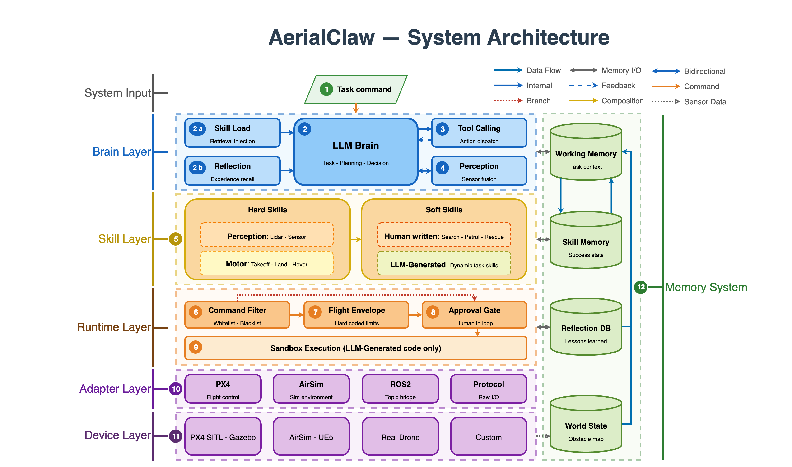

# 🦅 AerialClaw：面向通用自主无人机系统的个性化AI智能体


<p>
  
  
  
  
  
  
</p>

[English](README.md) | **中文**

**AerialClaw** 是一个面向通用自主无人机系统的个性化AI智能体框架。系统提供标准化的原子动作技能库（起飞、导航、感知等），由大语言模型（LLM）在任务执行中实时感知环境、规划决策并组合调用这些技能——无需为每个任务预编写完整的飞行流程，同时赋予每架无人机独立的身份认知、任务记忆与技能进化能力。

通过 Markdown 文档定义和维护智能体的认知状态与能力边界，由模型自主读写更新，实现真正的"个性化"——每架无人机都拥有属于自己的经验、偏好与成长轨迹。

> *"不预设流程，只定义能力——让每架无人机在任务中自主思考、积累经验、持续成长。"*

<p align="center">
  
</p>

---
---
---

## 📢 更新日志

- **(2026/5/12)** PX4+Gazebo Web 控制台维护更新 — 修复 Gazebo 摄像头 / LiDAR 到 Web UI 的数据流，新增本地仿真演示用 Gazebo direct adapter，修复驾驶舱速度控制与遥测同步问题，避免 LLM 解析失败被伪装成任务成功，在 LLM 通道不可用时为简单指令提供确定性兜底计划，并让运行时模型渠道 / 模型配置持久化，同时对 URL、模型名、鉴权等错误返回安全可读提示。
- **(2026/3/24)** AerialClaw v2.0 更新 — 安全包线、四层记忆、通用设备协议、自进化引擎、AirSim 上海城市场景集成、自主城市巡检演示、GPT-4o 视觉感知、实时地图更新、Doctor Agent 适配器、WASD 手动控制、平滑插值飞行。
- **(2026/3/14)** AerialClaw v1.0 发布 — 完整 Agent 决策循环、12 项硬技能、反思引擎、Web 控制台、PX4+Gazebo 仿真集成。


## 📑 目录

- [研究背景与动机](#研究背景与动机)
- [系统架构设计](#系统架构设计)
- [决策机制](#决策机制自主循环实现)
- [技能体系](#技能体系)
- [感知系统](#感知系统)
- [仿真演示环境](#仿真演示环境)
- [Web 监控界面](#web-监控界面)
- [安装与部署](#安装与部署)
- [快速开始](#快速开始)
- [项目结构](#项目结构)
- [致谢](#致谢)

## 研究背景与动机

当前无人机系统大多依赖预编程脚本，缺乏对未知环境的适应能力。AerialClaw 探索通过 LLM 赋予无人机**自主理解环境与实时决策**的能力：

- 🧠 **推理而非仅执行** — LLM 解析任务目标，生成分步决策
- 👁️ **语义级环境理解** — 多源传感器数据转为自然语言，支持常识推理
- 📝 **飞行经验自积累** — 任务记忆库，基于历史经验优化决策
- 🪪 **能力边界自感知** — 维护性能档案，记录能力边界与表现

## 系统架构设计

<p align="center">
  
</p>

### 核心设计原则

1. **第一人称决策视角** — 以无人机为主体视角进行决策
2. **语义级传感器融合** — 原始传感器数据转换为 LLM 可理解的语义描述
3. **文档驱动技能定义** — 飞行动作与策略以可读文档形式存储，支持动态加载
4. **分层记忆管理机制** — 长期经验积累与短期上下文的高效平衡

## 决策机制：自主循环实现

系统采用基于实时感知的增量决策机制，每一步执行完整的认知循环：

<p align="center">
  
</p>

系统具备基础异常处理能力：路径受阻时重新规划，发现意外目标时调整注意力，电量不足时执行返航。

### 身份与状态管理系统

| 文档 | 功能描述 | 内容示例 |
|------|---------|----------|
| `robot_profile/SOUL.md` | 定义决策偏好与约束 | *安全优先策略，保守风险评估* |
| `robot_profile/BODY.md` | 记录硬件配置与性能参数 | *传感器类型，飞行性能边界* |
| `robot_profile/WORLD_MAP.md` | 构建环境特征知识库 | *已知区域的地标与风险点* |

运行态经验与技能统计文件会在本地实验过程中生成，公开仓库中刻意不提交这些生成内容，以避免把实验日志、坐标或运行缓存混入开源 repository package。

### 技能体系

系统采用**硬技能 + 软技能两层架构** — 硬技能处理所有原子操作，软技能提供策略组合：

<p align="center">
  
</p>

**硬技能（16 项原子操作）** — 所有可直接执行的动作：

| 类别 | 技能 | 说明 |
|:---|:---|:---|
| 飞行控制 | `takeoff` `land` `hover` `fly_to` `fly_relative` `change_altitude` `return_to_launch` | 起降、悬停、定点飞行、相对位移、变高、返航 |
| 环境感知 | `look_around` `detect_object` `fuse_perception` | 多方位观察、目标检测（VLM）、多传感器语义融合 |
| 状态查询 | `get_position` `get_battery` | 获取当前位置、电量状态 |
| 标记管理 | `mark_location` `get_marks` | 标记兴趣点、查询已标记位置 |
| 计算能力 | `run_python` `http_request` `read_file` `write_file` | 沙箱代码执行、HTTP 请求、文件读写 |

硬技能涵盖物理无人机控制和信息处理两大类——例如在规划飞行路径前查询天气 API，或用 Python 计算最优路线。所有硬技能内置安全机制：`run_python` 在自动降级沙箱中运行（Docker → subprocess → restricted），`http_request` 屏蔽内网并强制超时，文件操作限制在工作目录内并记录审计日志。

**软技能（策略文档）**：

| 策略 | 说明 |
|:---|:---|
| `search_target` | 区域搜索 — LLM 自主规划搜索路径，融合视觉与雷达判断目标 |
| `rescue_person` | 人员救援 — 发现目标后的接近、评估、标记、上报全流程 |
| `patrol_area` | 区域巡逻 — 按策略覆盖区域，持续监控异常 |

软技能以 Markdown 文档形式存储。执行时，LLM 读取文档理解策略意图，自主组合运动、认知和感知技能完成任务。系统还支持**动态生成新软技能**：当 LLM 在反思中发现重复的行为模式时，会自动提取为新的策略文档。

后续我们计划探索以**技能网络（Skill Network）对软技能的组合与调度进行建模**，使策略选择从纯 LLM 推理逐步演进为可学习、可优化的决策网络。更长远地，我们希望将 AerialClaw 的核心架构解耦为一套**面向通用智能设备的框架**——通过标准化的协议适配层接入各类嵌入式硬件，让任何具备传感与执行能力的设备都能获得同样的自主智能。

### 感知系统

技能的执行离不开对环境的感知。系统采用**被动 + 主动双层感知架构**，为 LLM 的决策提供不同粒度的环境信息：

- **被动感知**（`PerceptionDaemon`）— 后台持续运行，周期性融合多传感器数据生成环境摘要，为 LLM 提供实时态势感知
- **主动感知**（`VLMAnalyzer`）— 由 LLM 按需触发，调用视觉语言模型对图像进行深度分析（目标检测、场景理解等）

感知模型支持**可插拔配置**：可接入云端 API（GPT-4o 等）、本地部署的开源模型、或自行微调的专用模型，以适应不同部署场景对延迟、精度和隐私的需求。

该设计支持研究多种应用场景：
- 🏚️ **灾害响应** — 废墟环境的人员搜救
- 🌲 **生态监测** — 森林区域的异常检测
- 🏗️ **设施巡检** — 建筑结构的安全检查
- 🌾 **农业观测** — 作物生长状态的评估

## 仿真演示环境

目前已在 **AirSim + OpenFly** 仿真环境（上海城市场景）中构建验证平台：

<p align="center">
  
  <br>
  <em>上海城市场景自主飞行 — AI 驱动的高楼间导航与实时感知</em>
</p>

| 组件 | 技术选型 |
|------|----------|
| 飞控系统 | AirSim SimpleFlight（API 控制） |
| 仿真环境 | Unreal Engine 4 + OpenFly AirSim（上海城市场景） |
| 传感器模型 | 前向摄像头 + 模拟 LiDAR（360°） |
| 大模型 / 视觉模型 | GPT-4o（规划、感知、报告生成） |
| 通信协议 | AirSim RPC（纯 Socket msgpack） |
| 坐标系 | NED（北-东-地）局部坐标系 |

**仿真场景要素**：高层商业区、中层住宅楼群、低层建筑、城市道路、空旷起降区。

## Web 监控界面

<p align="center">
  
</p>

提供研究所需的可视化与交互工具：
- 📷 **多视角视频流** — 前/后/左/右/下五路摄像头实时画面
- 📡 **激光雷达可视化** — 3D LiDAR 点云数据的多层渲染显示
- 🕹️ **手动控制模式** — 支持键盘操控的 FPV 第一人称视角
- 🤖 **AI 自主模式** — 自然语言下达任务，LLM 自主规划执行
- 💬 **指令交互界面** — 自然语言任务指令与对话式交互
- 📊 **状态监控面板** — 飞行参数与系统状态的实时显示
- ⚙️ **模型配置管理** — 支持多 LLM 后端的切换与配置

系统提供**手动 / AI 双模式实时切换**，操作员可随时从 AI 自主模式接管控制权，执行过程中支持一键打断。这是面向真实部署场景的基本安全保障——AI 负责决策，人始终拥有最终否决权。

## 安装与部署

README 只保留当前仓库包中定期验证的启动路径。仿真器集成会受宿主机系统、驱动、PX4/Gazebo 安装状态影响；相关命令应在目标环境实测后放入专门的仿真文档，而不是写成通用快速启动。

### 运行模式

| 运行模式 | 用途 | README 状态 |
|---|---|---|
| **容器 mock** | 使用预构建镜像进行快速演示和 UI/API smoke test | 已验证路径 |
| **本地 mock** | 不连接外部仿真器的源码开发调试 | 已验证路径 |
| **PX4 + Gazebo 集成** | 面向研究实验的完整仿真集成 | 高级集成路径；使用前需在目标仿真主机验证 |

### 1. 容器 mock 模式 —— 已验证快速启动

该路径不需要 PX4、Gazebo、AirSim、GPU、真实无人机、LLM API Key，也不需要在用户电脑上本地构建镜像。

```bash
git clone https://github.com/XDEI-Group/AerialClaw.git
cd AerialClaw
docker compose up
```

等价的普通 Docker 命令：

```bash
docker run --rm -p 5001:5001 xdei/aerialclaw:mock
```

另开终端验证：

```bash
curl http://localhost:5001/api/status
```

然后打开：

```text
http://localhost:5001
```

开发者本地构建 fallback：

```bash
docker compose -f compose.build.yml up --build
```

### 2. 本地 mock 模式 —— 已验证开发路径

适合本地改源码、不连接外部仿真器时使用。

#### macOS / Linux

```bash
git clone https://github.com/XDEI-Group/AerialClaw.git
cd AerialClaw

python3 -m venv venv
source venv/bin/activate
python -m pip install --upgrade pip
pip install -r requirements.txt
pip install pytest
python -m pytest

cd ui
npm install
npm run build
cd ..

SIM_ADAPTER=mock python server.py
```

另开终端验证：

```bash
curl http://localhost:5001/api/status
```

Unix-like shell 可选仓库 smoke gate：

```bash
bash scripts/smoke_mock.sh
```

#### Windows 本地 mock 说明

仓库提供 Windows PowerShell smoke 脚本：

```powershell
.\scripts\smoke_mock.ps1
```

请在安装 Python 3.10+ 和 Node.js 的普通 Windows 环境中使用。若 Windows checkout 改变 shell 脚本换行，仓库中的 `.gitattributes` 会保证后续 clean checkout 使用适合 Bash 的 LF 配置。

### 可选：PX4 + Gazebo 仿真器集成

如果只是运行公开演示或做源码开发，执行完 **容器 mock 模式** 或 **本地 mock 模式** 就可以停止。PX4 + Gazebo 不是模式 1/2 后必须继续执行的第三步，而是给需要接入完整仿真器的用户准备的独立高级路径。

仿真器集成依赖宿主机系统包、图形/驱动状态、PX4 SITL 和 Gazebo 安装细节；使用具体仿真命令前，先验证目标环境。从这里开始：

```text
docs/SIMULATION_SETUP.md
```

较重的 Gazebo Compose 入口与默认 mock 路径分离：

```bash
docker compose -f compose.gazebo.yml config
```

### 可选 LLM 配置

Mock 模式和基础 Web 控制台不需要 LLM API Key。若要启用自然语言自主规划，复制 `.env.example` 并配置兼容 OpenAI 的模型服务：

```bash
cp .env.example .env
# 编辑 ACTIVE_PROVIDER、LLM_BASE_URL、LLM_API_KEY、LLM_MODEL
```

支持 OpenAI、DeepSeek、Moonshot、本地 Ollama 等兼容 OpenAI 接口的服务。详见 [docs/LLM_CONFIG.md](docs/LLM_CONFIG.md)。

## 快速开始

启动 Docker mock、本地 mock 或 PX4/Gazebo 任一路径后，打开：

```text
http://localhost:5001
```

在 Web 界面中：
1. 点击「⚡ 初始化系统」
2. 已配置 LLM 时可切换到右上角「🤖 AI」模式；仅 smoke 测试时可使用 manual/mock 控制
3. 可尝试输入：
   - *"起飞至15米高度并观察周围环境"*
   - *"搜索北部区域，发现目标后拍照记录"*
   - *"报告当前电量和位置"*

## 项目结构

```
AerialClaw/
├── server.py                    # 服务入口（REST + WebSocket）
├── config.py                    # 全局配置（从 .env 读取）
├── llm_client.py                # LLM 多 Provider 客户端
├── requirements.txt             # Python 依赖
│
├── brain/                       # 认知决策层
│   ├── agent_loop.py            #   自主决策循环
│   ├── planner_agent.py         #   LLM 任务规划器（记忆感知）
│   └── chat_mode.py             #   对话模式
│
├── core/                        # 核心系统
│   ├── errors.py                #   异常类 + 修复提示
│   └── logger.py                #   彩色终端 + 7 天文件轮转
│
├── perception/                  # 感知系统
│   ├── daemon.py                #   被动感知守护线程
│   ├── passive_perception.py    #   后台传感器融合
│   ├── vlm_analyzer.py          #   主动视觉分析（云端 VLM）
│   ├── prompts.py               #   感知提示词
│   └── gz_camera.py             #   Gazebo 摄像头桥接
│
├── skills/                      # 两层技能架构
│   ├── motor_skills.py          #   硬技能：飞行控制、感知、状态查询
│   ├── perception_skills.py     #   硬技能：检测、观察、扫描
│   ├── cognitive_skills.py      #   硬技能：Python 执行、HTTP 请求、文件读写
│   ├── observe_skill.py         #   硬技能：多方位观察
│   ├── soft_skill_manager.py    #   策略层：文档驱动组合
│   ├── soft_docs/               #   软技能策略文档（Markdown）
│   ├── registry.py              #   技能注册中心（即插即用）
│   ├── skill_loader.py          #   动态技能加载
│   ├── dynamic_skill_gen.py     #   运行时技能生成
│   └── docs/                    #   技能文档
│
├── memory/                      # 四层记忆系统
│   ├── memory_manager.py        #   记忆编排器
│   ├── episodic_memory.py       #   情节记忆（任务历史）
│   ├── skill_memory.py          #   技能记忆（执行统计）
│   ├── world_model.py           #   世界模型（环境状态）
│   ├── vector_store.py          #   向量语义检索
│   ├── shared_memory.py         #   跨设备共享记忆
│   ├── reflection_engine.py     #   任务后反思（LLM）
│   ├── skill_evolution.py       #   技能进化追踪
│   └── task_log.py              #   结构化任务日志
│
├── adapters/                    # 硬件抽象层
│   ├── sim_adapter.py           #   抽象接口（所有适配器）
│   ├── adapter_manager.py       #   适配器注册 + 初始化
│   ├── px4_adapter.py           #   PX4 SITL + MAVSDK（Gazebo）
│   ├── mavsdk_adapter.py        #   MAVSDK + AirSim 混合适配器
│   ├── airsim_adapter.py        #   AirSim SimpleFlight 适配器
│   ├── airsim_physics.py        #   AirSim 物理仿真
│   ├── airsim_rpc.py            #   AirSim msgpack-RPC 客户端
│   └── mock_adapter.py          #   Mock 测试适配器
│
├── robot_profile/               # 身份文档
│   ├── SOUL.md / BODY.md        #   人格与硬件描述
│   ├── WORLD_MAP.md             #   环境地图
│   └── body_generator.py        #   从在线设备自动生成 BODY.md
│   # 运行态记忆/技能统计文件由本地实验生成，不作为公开仓库交付文件
│
├── config/                      # 配置文件
│   ├── sim_config.yaml          #   仿真参数
│   ├── safety_config.yaml       #   安全包线限制
│   └── camera_spawn.sdf         #   摄像头部署定义
│
├── scripts/                     # 自动化脚本
│   ├── doctor_gazebo.sh         #   只读 PX4/Gazebo 配置诊断
│   ├── setup_px4.sh             #   一键 PX4 + Gazebo 环境搭建
│   ├── start_sim.sh             #   仿真启动器
│   ├── smoke_mock.sh            #   本地 mock demo smoke gate
│   └── check_repository package.py        #   仓库一致性检查器
│
├── ui/                          # Web 监控界面（React）
│   └── src/components/          #   React 驾驶舱、地图、技能、传感器与组件
│
├── docs/                        # 开发文档
│   ├── SIMULATION_SETUP.md      #   PX4 + Gazebo 搭建指南
│   ├── ARCHITECTURE.md          #   系统架构
│   ├── FAQ.md                   #   已知问题 + 解决方案
│   └── ...                      #   适配器、技能、感知指南
│
└── assets/                      # 图片与演示资源
```

## 研究进展与计划

### 已实现（v2.0）
- [x] 自主决策循环 · 身份与状态管理 · 硬/软两层技能架构
- [x] 被动 + 主动双层感知 · 经验积累与反思 · 动态技能生成
- [x] PX4 + Gazebo 仿真集成 · Web 监控与交互界面（15 个组件）
- [x] 分层安全控制架构 — 命令过滤 → 沙箱 → 审批 → 安全包线
- [x] 四层记忆系统 — 工作 / 情节 / 技能 / 世界 + 向量检索
- [x] 通用设备协议 — REST + WebSocket 设备接入接口
- [x] 自进化研究模块 — 设备分析、代码生成与技能优化原型
- [x] 设备生命周期概念 — 对话建档、能力画像与技能绑定设计
- [ ] Python / Arduino / ROS2 多平台客户端生产级 SDK
- [ ] 端云协同混合部署打包

### 未来方向
- [ ] 真实无人机移植 · Sim2Real 迁移
- [ ] 多平台客户端 SDK · 端云协同部署打包
- [ ] 多智能体协作 · MCP 标准接口 · 跨设备共享学习

## Repository Package 运行指南

面向使用者的快速启动、mock mode 运行路径、预期输出与已知限制见 [QUICKSTART.md](QUICKSTART.md)。

## 参与贡献

欢迎 Issue 和 PR。详见 [docs/](docs/) 中的开发文档。

## 开源协议

本项目采用 [MIT License](LICENSE) 开源协议。

## 致谢

项目由西安电子科技大学计算机科学与技术学院 ROBOTY 实验室开发。

研究思路受到 [OpenClaw](https://github.com/openclaw/openclaw) 项目的启发。基于以下开源技术构建：
[PX4](https://px4.io/) · [Gazebo](https://gazebosim.org/) · [MAVSDK](https://mavsdk.mavlink.io/) · [React](https://react.dev/) · [Vite](https://vitejs.dev/)
